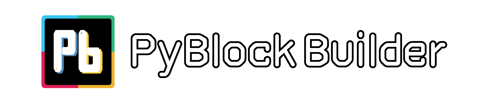
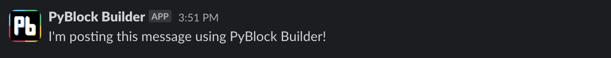
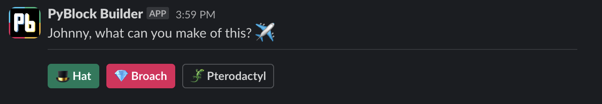
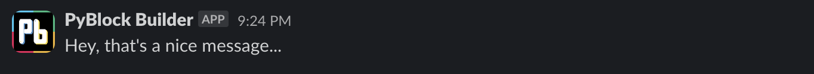
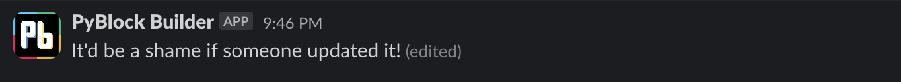
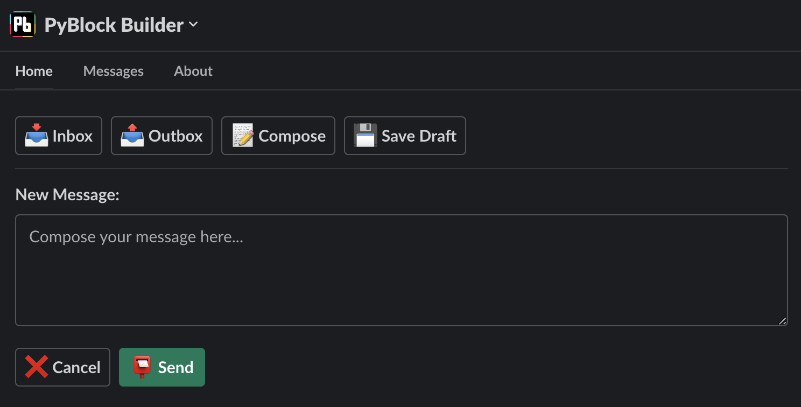
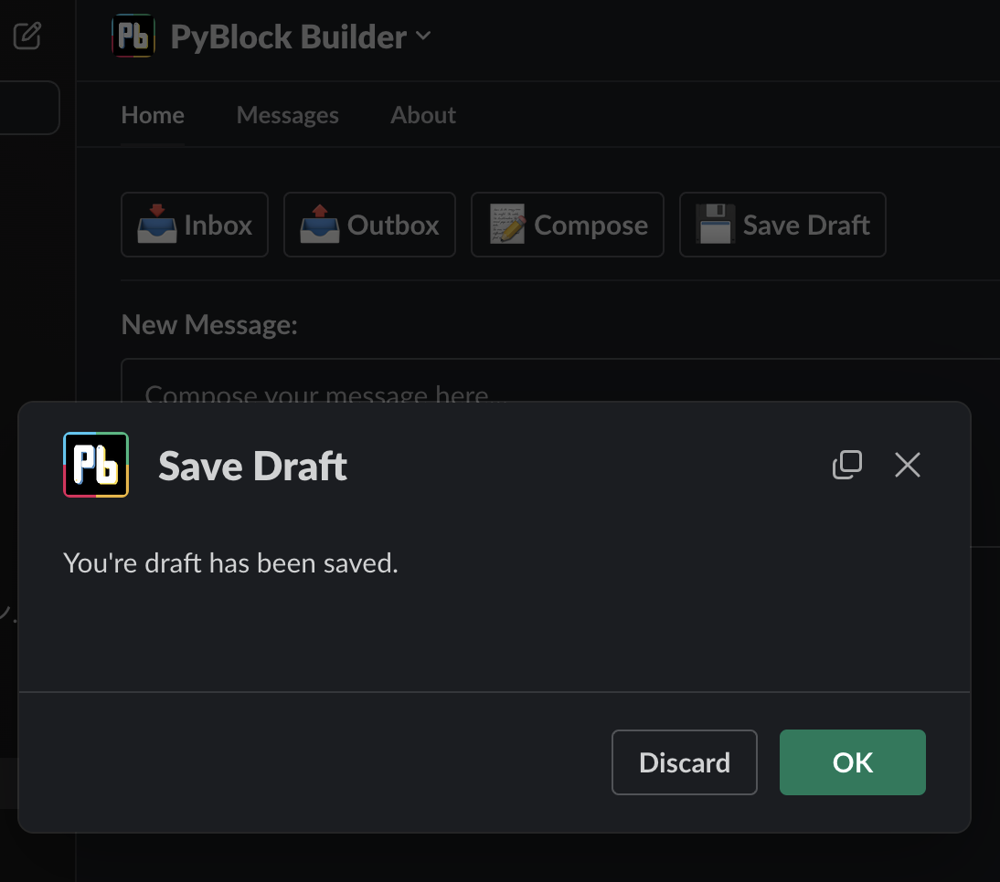
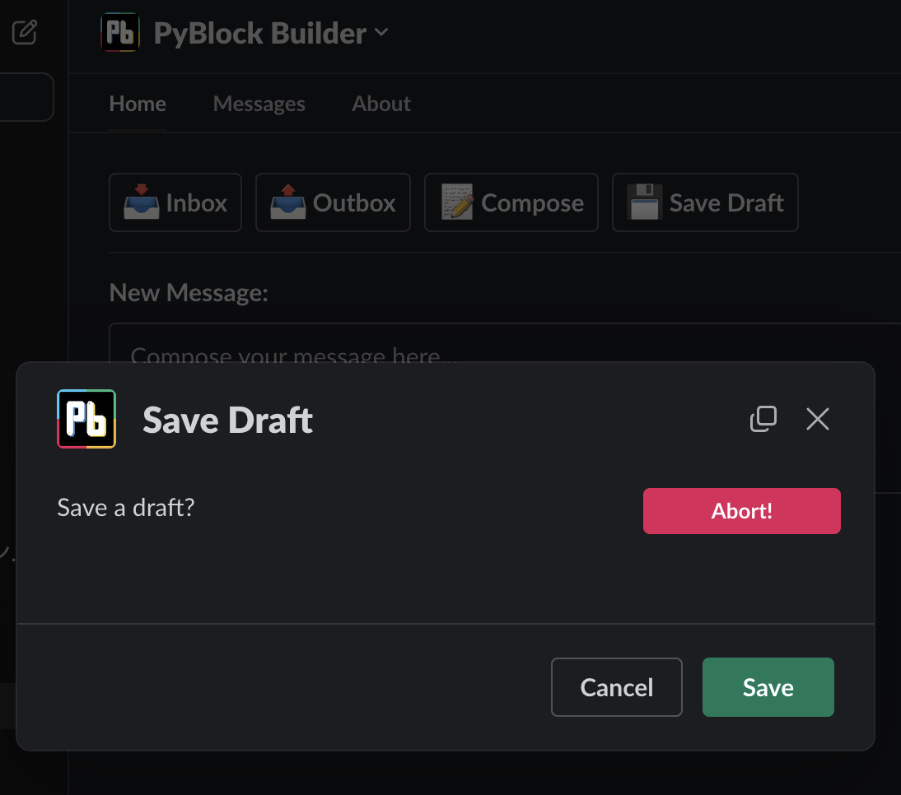
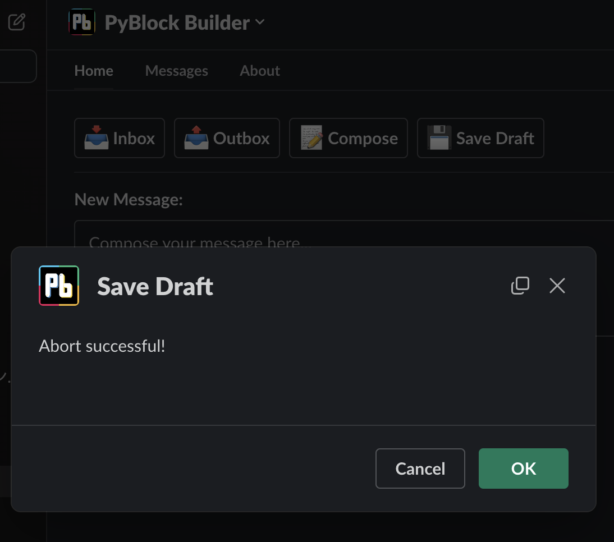

---
**PyBlock Builder** is a lightweight library written in Python for constructing UI with Slack's [Block Kit UI](https://api.slack.com/block-kit) 
framework. It was designed to make it easier for anyone—from hobbyists to professional devs—to create Slack apps faster 
with fewer lines of code. 

For the purposes of demonstrating how to use the features of **PyBlock Builder**, this documentation assumes at least 
basic familiarity with the Slack platform, the Slack API, the [Block Kit UI](https://api.slack.com/block-kit) framework, and the [Bolt for Python SDK](https://slack.dev/bolt-python/tutorial/getting-started). 
If you are new to any or all of these, please check out the great documentation provided by Slack from the link above.

---


## 💡 Features

- Optimized for use with Slack's [Bolt for Python SDK](https://slack.dev/bolt-python/tutorial/getting-started)
- Declarative syntax with method chaining
- IDE-friendly with descriptive docstrings describing each component and its methods
- Helper module with functions to simplify formatting text in Slack's `mrkdwn` standard 

## 🎯Benefits

- Write more efficient, easier-to-understand code in less time

---

# 🔰 Getting Started

## :one: Installation

### Using pip: 
```python 
pip install pyblock-builder
```
###### *Note that macOS/Linux users may need to use `pip3` instead of `pip` depending on your individual environment settings.

## :two: Usage

**PyBlock Builder** is made up of the following components:

`surfaces` - A collection of classes representing app surfaces on the Slack platform, such as `Message` and `AppHome`.

`blocks` - A collection of classes representing blocks—visual components that can be arranged to
create app layouts—from Slack's Block Kit UI framework. These can be added to your app's `surfaces` and include `Section` and `Input`.

`elements` - A collection of classes representing block elements—the UI elements such as `Button` and `SelectMenu`
used to capture user interaction. These can be added to your app's `blocks`.

`objects` - A collection of classes representing composition objects—items used to define text, options, or other
interactive features within certain `blocks` and block `elements`. These include `Text`, `Option`, and `ConfirmationDialog`.

`mrkdwn` - A collection of functions provided to simplify working with Slack's `mrkdwn` standard, such as `bold()` or 
`blockquote()`.

### Compatibility

The current version of **PyBlock Builder** features support for the following parts of the Slack API and Block Kit framework:


|                                 |     Supported?      | Corresponding PyBlock Builder Class                                                                                                                                                                                 |
|---------------------------------|:-------------------:|---------------------------------------------------------------------------------------------------------------------------------------------------------------------------------------------------------------------|
| **App Surfaces**                |                     |                                                                                                                                                                                                                     |
| └ App Home                      | :white_check_mark:  | `surfaces.app_home.AppHome()`                                                                                                                                                                                       |
| └ Modal                         | :white_check_mark:  | `surfaces.modal.Modal()`                                                                                                                                                                                            |
| └ Message                       | :white_check_mark:  | `surfaces.message.Message()`                                                                                                                                                                                        |
| └ Workflow Step                 |         :x:         |                                                                                                                                                                                                                     |
| **Blocks**                      |                     |                                                                                                                                                                                                                     |
| └ Actions                       | :white_check_mark:  | `blocks.actions.Actions()`                                                                                                                                                                                          |
| └ Context                       | :white_check_mark:  | `blocks.context.Context()`                                                                                                                                                                                          |
| └ Divider                       | :white_check_mark:  | `blocks.divider.Divider()`                                                                                                                                                                                          |
| └ File                          | :white_check_mark:  | `blocks.file.File()`                                                                                                                                                                                                |
| └ Header                        | :white_check_mark:  | `blocks.headaer.Header()`                                                                                                                                                                                           |
| └ Image                         | :white_check_mark:  | `blocks.image.Image()`                                                                                                                                                                                              |
| └ Input                         | :white_check_mark:  | `blocks.input.Input()`                                                                                                                                                                                              |
| └ Rich Text                     |         :x:         |                                                                                                                                                                                                                     |
| └ Section                       | :white_check_mark:  | `blocks.section.Section()`                                                                                                                                                                                          |
| └ Video                         | :white_check_mark:  | `blocks.video.Video()`                                                                                                                                                                                              |
| **Block Elements**              |                     |                                                                                                                                                                                                                     |
| └ Button                        | :white_check_mark:  | `elements.button.Button()`                                                                                                                                                                                          |
| └ Checkboxes                    | :white_check_mark:  | `elements.checkboxes.Checkboxes()`                                                                                                                                                                                  |
| └ Date Picker                   | :white_check_mark:  | `elements.date_picker.DatePicker()`                                                                                                                                                                                 |
| └ Datetime Picker               | :white_check_mark:  | `elements.datetime_picker.DatetimePicker()`                                                                                                                                                                         |
| └ Email Input                   | :white_check_mark:  | `elements.email_input.EmailInput()`                                                                                                                                                                                 |
| └ Image                         | :white_check_mark:  | `elements.image.ImageElement()`                                                                                                                                                                                     |
| └ Multi-select Menu             | :white_check_mark:  | `elements.multiselect_menu.MultiStaticSelect()`<br/>`elements.multiselect_menu.MultiUsersSelect()`<br/>`elements.multiselect_menu.MultiConversationsSelect()`<br/>`elements.multiselect_menu.MultiChannelsSelect()` |
| └ Number Input                  | :white_check_mark:  | `elements.number_input.NumberInput()`                                                                                                                                                                               |
| └ Overflow Menu                 | :white_check_mark:  | `elements.overflow_menu.OverflowMenu()`                                                                                                                                                                             |
| └ Plain-text Input              | :white_check_mark:  | `elements.plain_text_input.PlainTextInput()`                                                                                                                                                                        |
| └ Radio Buttons                 | :white_check_mark:  | `elements.radio_buttons.RadioButtons()`                                                                                                                                                                             |
| └ Select Menu                   | :white_check_mark:  | `elements.select_menu.StaticSelectMenu()`<br/>`elements.select_menu.UsersSelectMenu()`<br/>`elements.select_menu.ConversationsSelectMenu()`<br/>`elements.select_menu.ChannelsSelectMenu()`                         |
| └ Time Picker                   | :white_check_mark:  | `elements.time_picker.TimePicker()`                                                                                                                                                                                 |
| └ URL Input                     | :white_check_mark:  | `elements.url_input.UrlInput()`                                                                                                                                                                                     |
| └ Workflow Button               |         :x:         |                                                                                                                                                                                                                     |
| **Composition Objects**         |                     |                                                                                                                                                                                                                     |
| └ Confirmation Dialog           | :white_check_mark:  | `objects.confirmation_dialog.ConfirmationDialog()`                                                                                                                                                                  |
| └ Conversations Filter          | :white_check_mark:  | `objects.conversations_filter.ConversationsFilter()`                                                                                                                                                                |
| └ Dispatch Action Configuration | :white_check_mark:  | `objects.dispatch_action_configuration.DispatchActionConfig()`                                                                                                                                                      |
| └ Option                        | :white_check_mark:  | `objects.option.Option()`                                                                                                                                                                                           |
| └ Options Group                 | :white_check_mark:  | `objects.options_group.OptionsGroup()`                                                                                                                                                                              |
| └ Text                          | :white_check_mark:  | `objects.text.Text()`                                                                                                                                                                                               |
| └ Trigger                       |         :x:         |                                                                                                                                                                                                                     |
| └ Workflow Object               |         :x:         |                                                                                                                                                                                                                     |


### Importing

The best practice for `surfaces`, `blocks`, `elements`, and `objects` is to import only the components required using absolute imports. 

For example, a simple chatbot app may begin with something like this:
```python
from pyblock_builder.surfaces import Message
from pyblock_builder.blocks import Section, Actions
from pyblock_builder.elements import Button
```
For **PyBlock Builder's** `mrkdwn` helper functions, the best practice is to import the module using the alias `md` to 
avoid any potential conflict or confusion with similarly named functions or variables.
```python
# Allow for formatting using syntax such as md.bold(), md.emoji(), etc.
from pyblock_builder import mrkdwn as md
```
However, if this is not to your liking and you are confident that no such conflicts or confusion will arise, you may 
alternatively import the module in such a way as to enable access to each helper function directly:
```python
# Enable bold(), blockquote(), inline_code(), and link() to be called directly. 
# Recommended when you know you will only need a few specific funtions
from pyblock_builder.mrkdwn import bold, blockquote, inline_code, link

# Enable all functions in the module to be called directly
from pyblock_builder.mrkdwn import *
```
### Working with Messages

Messages are the core of the Slack platform and **PyBlock Builder** is optimized for use with Slack's 
[Bolt for Python SDK](https://slack.dev/bolt-python/tutorial/getting-started) to make working with them as efficient and 
painless as possible. 

- #### Composing a Message
  Messages in **PyBlock Builder** are naturally constructed using the `Message` class from the `surfaces` module. 
  The following is an example of how to compose a barebones message:
  ```python
  from pyblock_builder.surfaces import Message

  (Message()
   .set_text("I'm posting this message with PyBlock Builder!") # main body text of the message
   .set_channel("C12345") # ID of the channel for posting or user ID for DM
  )
  ```

  ###### *Note that the `()` wrapping the code constructing the instance of the `Message` object is required by PyCharm and other IDEs to ensure proper indentation for method chaining and serves no functional purpose in **PyBlock Builder**.

    A more complex message may, of course, include—you guessed it!—blocks!
    ```python
    from pyblock_builder.surfaces import Message
    from pyblock_builder.blocks import Section, Divider, Actions
    from pyblock_builder.elements import Button
    from pyblock_builder import mrkdwn as md
    
    (Message()
     .add_blocks(
        Section()
        .set_text(f"Johnny, what can you make out of this? {md.emoji('airplane')}"),
        Divider(),
        Actions()
        .add_elements(
            Button()
            .set_label(f"{md.emoji('tophat')} Hat")
            .set_value("hat-button")
            .set_action_id("hat_button_pressed")
            .set_style("primary"), # colors a button green
            Button()
            .set_label(f"{md.emoji('gem')} Broach")
            .set_value("broach-button")
            .set_action_id("broach_button_pressed")
            .danger(), # colors a button red; alternative to using set_style("danger")
            Button()
            .set_label(f"{md.emoji('lizard')} Pterodactyl")
            .set_value("pterodactyl-button")
            .set_action_id("pterodactyl_button_pressed"),
        )
     )
     .set_text("Johnny, what can you make of this?") # when blocks are used this becomes a fallback string for display in notifcations
     .set_channel("C12345") # ID of the channel for posting or user ID for DM
    )
    ```
- #### Posting and Scheduling Messages
  
  While the above examples show how simple and intuitive it is to construct a message using **PyBlock Builder**,
  `Message` objects are also equipped with some handy features that allow for easier posting and scheduling when 
  using Slack's [Bolt for Python SDK](https://slack.dev/bolt-python/tutorial/getting-started).
  ```python
  # Simple demonstration of how to post a message with Slack's Bolt for Python SDK and PyBlock Builder
  import os
  from slack_bolt import App
  from slack_bolt.adapter.socket_mode import SocketModeHandler
  from pyblock_builder.surfaces import Message

  # Initializes your app with your bot token and socket mode handler
  app = App(token=os.environ.get("SLACK_BOT_TOKEN"))

  (Message()
    .set_text("I'm posting this message using PyBlock Builder!") # main body text of the message
    .set_channel("C12345") # ID of the channel for posting or user ID for DM
    .post(app.client)
  )
  
  # Start your app
  if __name__ == "__main__":
    SocketModeHandler(app, os.environ["SLACK_APP_TOKEN"]).start()
  ```
  Output:

  As demonstrated above, posting our first messsage example from above with **PyBlock Builder** is as simple as passing the `WebClient` provided to
  your Bolt app as `app.client` to the `post()` method of the `Message` object. **PyBlock Builder** takes care of the 
  rest for you! Now, let's try scheduling our more complex message example to be sent at a certain time:
  ```python
  # Simple demonstration of how to schedule a message with Slack's Bolt for Python SDK and PyBlock Builder
  import os
  from datetime import datetime
  from slack_bolt import App
  from slack_bolt.adapter.socket_mode import SocketModeHandler
  from pyblock_builder.surfaces import Message
  from pyblock_builder.blocks import Section, Divider, Actions
  from pyblock_builder.elements import Button
  from pyblock_builder import mrkdwn as md

  # Initializes your app with your bot token and socket mode handler
  app = App(token=os.environ.get("SLACK_BOT_TOKEN"))

  # Create a datetime object representing the date and time for posting
  when_to_post = datetime(2023, 11, 29, 15, 59)
  
  (Message()
   .add_blocks(
      Section()
      .set_text(f"Johnny, what can you make out of this? {md.emoji('airplane')}"),
      Divider(),
      Actions()
      .add_elements(
          Button()
          .set_label(f"{md.emoji('tophat')} Hat")
          .set_value("hat-button")
          .set_action_id("hat_button_pressed")
          .set_style("primary"), # colors a button green
          Button()
          .set_label(f"{md.emoji('gem')} Broach")
          .set_value("broach-button")
          .set_action_id("broach_button_pressed")
          .danger(), # colors a button red; alternative to using set_style("danger")
          Button()
          .set_label(f"{md.emoji('lizard')} Pterodactyl")
          .set_value("pterodactyl-button")
          .set_action_id("pterodactyl_button_pressed"),
      )
   )
   .set_text("Johnny, what can you make of this?") # when blocks are used this becomes a fallback string for display in notifcations
   .set_channel("C12345") # ID of the channel for posting or user ID for DM
   .post_at(when_to_post)
   .post(app.client)
  )
  
  # Start your app
  if __name__ == "__main__":
    SocketModeHandler(app, os.environ["SLACK_APP_TOKEN"]).start()
  ```
  Output:

  That's it! Scheduling messages is as easy as using the `post_at()` method to set the date and time you wish your app to
  send the message before calling the `post()` method. For even more convenience, `post_at()` accepts values in the form 
  of a UNIX timestamp as a string or as a Python `datetime` object as shown above.
  ###### *Note that it is still possible to use **PyBlock Builder** without taking advantage of the methods optimized for use with Bolt for Python SDK by simply assigning an instance of a `Message` (or any other `surfaces`) object to a variable and passing its view payload using the `.view` attribute. The JSON payloads of `blocks`, block `elements`, or composition `objects` can similarly be accessed using the `.block` attribute (for the former) or the `.json` attribute (for the latter two) as needed.
- #### Updating and Deleting Messages
  Posting and scheduling messages is great, but what if you want to want to update or delete a message that your app has
  already sent? Fear not! **PyBlock Builder** has you covered!
  ```python
  """
  Simple demonstration of how to post and then update a message
  with Slack's Bolt for Python SDK and PyBlock Builder
  """
  import os
  from slack_bolt import App
  from slack_bolt.adapter.socket_mode import SocketModeHandler
  from pyblock_builder.surfaces import Message

  # Initializes your app with your bot token and socket mode handler
  app = App(token=os.environ.get("SLACK_BOT_TOKEN"))
  
  # Post a message and catch the response from the Slack API to reference its ID for updating later
  response = (Message()
              .set_text("Hey, that's a nice message...")
              .set_channel("C12345")
              .post(app.client))

  update_message_ts = response['message']['ts'] # also accessible via response['ts']
  
  # Start your app
  if __name__ == "__main__":
    SocketModeHandler(app, os.environ["SLACK_APP_TOKEN"]).start()
  ```
  Output:

  Now, all we have to do to update our message is pass in its `ts` ID which we've parsed from the Slack API response and 
  stored in `update_message_ts` using the `set_ts()` method when constructing a new `Message` object and then call the 
  `update()` method instead of the `post()` method.
  ```python
  # ...
  
  update_message_ts = response['message']['ts'] # also accessible via response['ts']
  
  (Message()
   .set_channel("C12345")
   .set_ts(update_message_ts)
   .set_text("It'd be a shame if someone updated it!")
   .update(app.client))
  
  # Start your app
  if __name__ == "__main__":
    SocketModeHandler(app, os.environ["SLACK_APP_TOKEN"]).start()
  ```
  Output:


  While updating an existing message requires the use of either `set_text()` or `add_blocks()` to define the new content
  for display in the message, deleting a message requires only the use of `set_channel()` and `set_ts()`:
  ```python
  # ...
  
  delete_message_ts = response['message']['ts'] # also accessible via response['ts']
  
  (Message()
   .set_channel("C12345")
   .set_ts(delete_message_ts)
   .delete(app.client))
  
  # Start your app
  if __name__ == "__main__":
    SocketModeHandler(app, os.environ["SLACK_APP_TOKEN"]).start()
  ```
### Working with App Home

The App Home surface is a place where users can enjoy alone time with your app. Like with messages, **PyBlock Builder** 
is optimized for use with Slack's [Bolt for Python SDK](https://slack.dev/bolt-python/tutorial/getting-started) to make publishing views to and updating views on App Home 
tabs a piece of cake.

- #### Composing a Home Tab View
  App Home views in **PyBlock Builder** are naturally constructed using the `AppHome` class from the `surfaces` module.
  The following is an example of how to compose a simple Home tab view:

  ```python
  # Simple example of a Home tab view with a message composer UI
  from pyblock_builder.surfaces import AppHome
  from pyblock_builder.blocks import Actions, Divider, Input
  from pyblock_builder.elements import Button, PlainTextInput
  from pyblock_builder.mrkdwn import emoji
  
  (AppHome()
   .add_blocks(
      Actions()
      .add_elements(
          Button()
          .set_label(f"{emoji('inbox_tray')} Inbox")
          .set_value("inbox-button")
          .set_action_id("view_inbox"),
          Button()
          .set_label(f"{emoji('outbox_tray')} Outbox")
          .set_value("outbox-button")
          .set_action_id("view_outbox"),
          Button()
          .set_label(f"{emoji('memo')} Compose")
          .set_value("compose-button")
          .set_action_id("compose_message"),
          Button()
          .set_label(f"{emoji('floppy_disk')} Save Draft")
          .set_value("save-button")
          .set_action_id("save_draft")
      ),
      Divider(),
      Input()
      .set_label("New Message: ")
      .add_element(
          PlainTextInput()
          .enable_multiline()
          .set_action_id("message_input")
          .set_placeholder_text(f"Compose your message here... ")
      ),
      Actions()
      .add_elements(
          Button()
          .set_label(f"{emoji('x')} Cancel")
          .set_value("cancel-button")
          .set_action_id("cancel_message"),
          Button()
          .set_label(f"{emoji('postbox')} Send")
          .set_value("send-button")
          .set_action_id("send_message")
          .primary()
      )
    )
  )
  ```

- #### Publishing and Updating Home Tab Views
  
  Great! So, composing a Home tabb view using **PyBlock Builder** is just as easy as composing a message! But how do I 
  actually make them show, you ask? Just like `Message` objects, `AppHome` objects are also equipped with a method that 
  allows for easier publishing and updating when using Slack's [Bolt for Python SDK](https://slack.dev/bolt-python/tutorial/getting-started).
  
  ```python
  # Simple example of a Home tab view with a message composer UI
  import os
  from slack_bolt import App
  from slack_bolt.adapter.socket_mode import SocketModeHandler
  from pyblock_builder.surfaces import AppHome
  from pyblock_builder.blocks import Actions, Divider, Input
  from pyblock_builder.elements import Button, PlainTextInput
  from pyblock_builder.mrkdwn import emoji

  # Initializes your app with your bot token and socket mode handler
  app = App(token=os.environ.get("SLACK_BOT_TOKEN"))

  # Subscribe to the app_home_opened event to listen for when users open your app
  @app.event("app_home_opened")
  def update_home_tab(client, event, logger):
      (AppHome()
       .add_blocks(
          Actions()
          .add_elements(
              Button()
              .set_label(f"{emoji('inbox_tray')} Inbox")
              .set_value("inbox-button")
              .set_action_id("view_inbox"),
              Button()
              .set_label(f"{emoji('outbox_tray')} Outbox")
              .set_value("outbox-button")
              .set_action_id("view_outbox"),
              Button()
              .set_label(f"{emoji('memo')} Compose")
              .set_value("compose-button")
              .set_action_id("compose_message"),
              Button()
              .set_label(f"{emoji('floppy_disk')} Save Draft")
              .set_value("save-button")
              .set_action_id("save_draft")
          ),
          Divider(),
          Input()
          .set_label("New Message: ")
          .add_element(
              PlainTextInput()
              .enable_multiline()
              .set_action_id("message_input")
              .set_placeholder_text(f"Compose your message here... ")
          ),
          Actions()
          .add_elements(
              Button()
              .set_label(f"{emoji('x')} Cancel")
              .set_value("cancel-button")
              .set_action_id("cancel_message"),
              Button()
              .set_label(f"{emoji('postbox')} Send")
              .set_value("send-button")
              .set_action_id("send_message")
              .primary()
          )
        )
      ).publish_view(client, event, logger)
  
  # Start your app
  if __name__ == "__main__":
    SocketModeHandler(app, os.environ["SLACK_APP_TOKEN"]).start()
  ```
  Output:


  Both publishing and updating views on App Home surfaces are done via the `publish_view()` method and require that the
  the app `client`, the `event` or `blocks_action` payload, and the instance of the `logger` class declared as arguments in the 
  `home_tab_opened()` function be passed to the `publish_view()` method.

### Working with Modals

Modals are focused surfaces that allow you to collect user data and display dynamic information. Like with messages and 
Home tab views, **PyBlock Builder** is optimized for use with Slack's [Bolt for Python SDK](https://slack.dev/bolt-python/tutorial/getting-started) to make working with
Modal views as simple as can be.

- #### Composing and Opening a Modal View

  Modal views in **PyBlock Builder** are naturally constructed using the `Modal` class from the `surfaces` module.
  The following example builds off of our simple message composer UI above and shows how to compose a simple Modal view 
  that opens when you click the "Save Draft" button:
  
  ```python
  # Listen for triggers invoking the action assigned to the "Save Draft" button using the set_action_id() method above
  @app.action("save_draft")
  def save_draft_view(ack, body, client):
      ack()
      (Modal()
       .set_title("Save Draft")
       .set_callback_id("save_modal")
       .set_submit_label("Save")
       .set_close_label("Discard")
       .add_blocks(
          Section()
          .set_text("Save a draft?")
       ).open_view(body, client))
  ```
  Output:
  
  
  Easy, right? Simply construct modals in the same manner as with messages and Home tab views and call the `Modal` 
  object's `open_view()` method, pass in the API response `body` and the Slack app `client` and leave the rest to 
  **PyBlock Builder**!

  - #### Updating and Pushing Modal Views

    So, what about updating an open modal view? Well, let's take the example from above and assume we'd like to let the
    user know their draft was saved successfully. To do this, we simple need to listen for a view submission from when the
    user clicks the "Save" button and respond accordingly:

    ```python
    # Listen for view submission using callback_id set above from Save Draft modal and handle it
    @app.view("save_modal")
    def handle_save_submission(ack):
        ack()
        (Modal()
         .set_title("Save Draft")
         .set_callback_id("save_modal_2")
         .set_submit_label("OK")
         .add_blocks(
            Section()
            .set_text("You're draft has been saved.")
         ).update_view_from_submission(ack)
        )
    ```
    Output:
    
  
    That's it! Just pass an instance of `ack`to the `Modal` object's `update_view_from_submission()` method and
    **PyBlock Builder** will update the content of the extisting view. Alternatively, if you'd like to push a new view on
    top of the existing view (Slack allows for an additional two views to be pushed on top of the original view), simply 
    pass the instance of `ack` to the `push_view_from_submission()` method instead. It should be noted, however, that this
    method only works for updating and pushing views on submission (i.e., the clicking of a modal's "submit" button). 
    Updating or pushing views in response to other actions require the use of the `Modal` object's `update_view()` and 
    `push_view()` methods. For example, if instead of clicking the "Save" button in our example above we clicked a new 
    "Abort!" button, the initial view could be opened using the code below:
    ```python
    # Listen for triggers invoking the "save_draft" action set using set_action_id() above
    @app.action("save_draft")
    def save_draft_view(ack, body, client):
        ack()
        (Modal()
         .set_title("Save Draft")
         .set_callback_id("save_modal")
         .set_submit_label("Save")
         .set_close_label("Cancel")
         .add_blocks(
            Section()
            .set_text("Save a draft?")
            .add_accessory(
                Button()
                .set_label("Abort!")
                .set_value("abort-button")
                .set_action_id("abort_save_draft")
                .danger()
            )
         ).open_view(body, client))
    ```
    Output:
  
  
  And subsequently updated and/or pushed by passing the API response `body` and the Slack app `client` to the `Modal` object's `update_view()`
  or `push_view()` methods accordingly:

  ```python
  @app.action("abort_save_draft")
  def abort_save_draft(ack, body, client):
      ack()
      (Modal()
       .set_title("Save Draft")
       .set_callback_id("save_modal_2")
       .set_submit_label("OK")
       .add_blocks(
          Section()
          .set_text("Abort successful!")
      ).update_view(body, client) # or .push_view(body, client) to push a new view on to the stack
    )
  ```
  Output:
