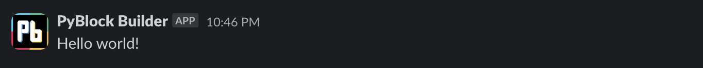

---
**PyBlock Builder** is a lightweight library written in Python for constructing UI with Slack's [Block Kit UI](https://api.slack.com/block-kit) framework. It was designed to make it easier for anyone—from hobbyists to professional devs—to create Slack apps faster with fewer lines of code. 

---


## 💡 Features

- Optimized for use with Slack's [Bolt for Python SDK](https://slack.dev/bolt-python/tutorial/getting-started)
- Declarative syntax with method chaining
- IDE-friendly with descriptive docstrings describing each component and its methods
- Helper module with functions to simplify formatting text in Slack's `mrkdwn` standard 

## 🎯Benefits

- Write more efficient, easier-to-understand code

---

# 🔰 Getting Started

## :one: Installation

### Using pip: 
```python 
pip install pyblock-builder
```
**Note:** Depending on your individual environment settings, macOS/Linux users may need to use `pip3` instead of `pip`.
## :two: Usage

**PyBlock Builder** is made up of the following components:

`surfaces` - A collection of classes representing app surfaces on the Slack platform, such as `Message` and `AppHome`.

`blocks` - A collection of classes representing blocks—visual components that can be arranged to
create app layouts—from Slack's Block Kit UI framework. These can be added to your app's `surfaces` and include `Section` and `Input`.

`elements` - A collection of classes representing block elements—the UI elements such as `Button` and `SelectMenu`
used to capture user interaction. These can be added to your app's `blocks`.

`objects` - A collection of classes representing composition objects—items used to define text, options, or other
interactive features within certain `blocks` and block `elements`. These include `Text`, `Option`, and `ConfirmationDialog`.

`mrkdwn` - A collection of functions provided to simplify working with Slack's `mrkdwn` standard, such as `bold()` or 
`blockquote()`.

### Compatibility

The current version of **PyBlock Builder** features support for the following parts of the Slack API and Block Kit framework:


|                                 |     Supported?      | Corresponding PyBlock Builder Class                                                                                                                                                                                 |
|---------------------------------|:-------------------:|---------------------------------------------------------------------------------------------------------------------------------------------------------------------------------------------------------------------|
| **App Surfaces**                |                     |                                                                                                                                                                                                                     |
| └ App Home                      | :white_check_mark:  | `surfaces.app_home.AppHome()`                                                                                                                                                                                       |
| └ Modal                         | :white_check_mark:  | `surfaces.modal.Modal()`                                                                                                                                                                                            |
| └ Message                       | :white_check_mark:  | `surfaces.message.Message()`                                                                                                                                                                                        |
| └ Workflow Step                 |         :x:         |                                                                                                                                                                                                                     |
| **Blocks**                      |                     |                                                                                                                                                                                                                     |
| └ Actions                       | :white_check_mark:  | `blocks.actions.Actions()`                                                                                                                                                                                          |
| └ Context                       | :white_check_mark:  | `blocks.context.Context()`                                                                                                                                                                                          |
| └ Divider                       | :white_check_mark:  | `blocks.divider.Divider()`                                                                                                                                                                                          |
| └ File                          | :white_check_mark:  | `blocks.file.File()`                                                                                                                                                                                                |
| └ Header                        | :white_check_mark:  | `blocks.headaer.Header()`                                                                                                                                                                                           |
| └ Image                         | :white_check_mark:  | `blocks.image.Image()`                                                                                                                                                                                              |
| └ Input                         | :white_check_mark:  | `blocks.input.Input()`                                                                                                                                                                                              |
| └ Rich Text                     |         :x:         |                                                                                                                                                                                                                     |
| └ Section                       | :white_check_mark:  | `blocks.section.Section()`                                                                                                                                                                                          |
| └ Video                         | :white_check_mark:  | `blocks.video.Video()`                                                                                                                                                                                              |
| **Block Elements**              |                     |                                                                                                                                                                                                                     |
| └ Button                        | :white_check_mark:  | `elements.button.Button()`                                                                                                                                                                                          |
| └ Checkboxes                    | :white_check_mark:  | `elements.checkboxes.Checkboxes()`                                                                                                                                                                                  |
| └ Date Picker                   | :white_check_mark:  | `elements.date_picker.DatePicker()`                                                                                                                                                                                 |
| └ Datetime Picker               | :white_check_mark:  | `elements.datetime_picker.DatetimePicker()`                                                                                                                                                                         |
| └ Email Input                   | :white_check_mark:  | `elements.email_input.EmailInput()`                                                                                                                                                                                 |
| └ Image                         | :white_check_mark:  | `elements.image.ImageElement()`                                                                                                                                                                                     |
| └ Multi-select Menu             | :white_check_mark:  | `elements.multiselect_menu.MultiStaticSelect()`<br/>`elements.multiselect_menu.MultiUsersSelect()`<br/>`elements.multiselect_menu.MultiConversationsSelect()`<br/>`elements.multiselect_menu.MultiChannelsSelect()` |
| └ Number Input                  | :white_check_mark:  | `elements.number_input.NumberInput()`                                                                                                                                                                               |
| └ Overflow Menu                 | :white_check_mark:  | `elements.overflow_menu.OverflowMenu()`                                                                                                                                                                             |
| └ Plain-text Input              | :white_check_mark:  | `elements.plain_text_input.PlainTextInput()`                                                                                                                                                                        |
| └ Radio Buttons                 | :white_check_mark:  | `elements.radio_buttons.RadioButtons()`                                                                                                                                                                             |
| └ Select Menu                   | :white_check_mark:  | `elements.select_menu.StaticSelectMenu()`<br/>`elements.select_menu.UsersSelectMenu()`<br/>`elements.select_menu.ConversationsSelectMenu()`<br/>`elements.select_menu.ChannelsSelectMenu()`                         |
| └ Time Picker                   | :white_check_mark:  | `elements.time_picker.TimePicker()`                                                                                                                                                                                 |
| └ URL Input                     | :white_check_mark:  | `elements.url_input.UrlInput()`                                                                                                                                                                                     |
| └ Workflow Button               |         :x:         |                                                                                                                                                                                                                     |
| **Composition Objects**         |                     |                                                                                                                                                                                                                     |
| └ Confirmation Dialog           | :white_check_mark:  | `objects.confirmation_dialog.ConfirmationDialog()`                                                                                                                                                                  |
| └ Conversations Filter          | :white_check_mark:  | `objects.conversations_filter.ConversationsFilter()`                                                                                                                                                                |
| └ Dispatch Action Configuration | :white_check_mark:  | `objects.dispatch_action_configuration.DispatchActionConfig()`                                                                                                                                                      |
| └ Option                        | :white_check_mark:  | `objects.option.Option()`                                                                                                                                                                                           |
| └ Options Group                 | :white_check_mark:  | `objects.options_group.OptionsGroup()`                                                                                                                                                                              |
| └ Text                          | :white_check_mark:  | `objects.text.Text()`                                                                                                                                                                                               |
| └ Trigger                       |         :x:         |                                                                                                                                                                                                                     |
| └ Workflow Object               |         :x:         |                                                                                                                                                                                                                     |


### Importing

The best practice for `surfaces`, `blocks`, `elements`, and `objects` is to import only the components required using absolute imports. 

For example, a simple chatbot app may begin with something like this:
```python
from pyblock_builder.surfaces import Message
from pyblock_builder.blocks import Section, Actions
from pyblock_builder.elements import Button
```
For **PyBlock Builder's** `mrkdwn` helper functions, the best practice is to import the module using the alias `md` to 
avoid any potential conflict or confusion with similarly named functions or variables.
```python
# Allow for formatting using syntax such as md.bold(), md.emoji(), etc.
from pyblock_builder import mrkdwn as md
```
However, if this is not to your liking and you are confident that no such conflicts or confusion will arise, you may 
alternatively import the module in such a way as to enable access to each helper function directly:
```python
# Enable bold(), blockquote(), inline_code(), and link() to be called directly. 
# Recommended when you know you will only need a few specific funtions
from pyblock_builder.mrkdwn import bold, blockquote, inline_code, link

# Enable all functions in the module to be called directly
from pyblock_builder.mrkdwn import *
```
### Working with Messages

Messages are the core of the Slack platform and **PyBlock Builder** is optimized for use with Slack's 
[Bolt for Python SDK](https://slack.dev/bolt-python/tutorial/getting-started) to make working with them as efficient and 
painless as possible. 

- #### Composing a Message
    Messages in **PyBlock Builder** are naturally constructed using the `Message` class from the `surfaces` module. The following is an example of a barebones message:
    ```python
    from pyblock_builder.surfaces import Message
  
    (Message()
     .set_text("Hello world!") # main body text of the message
     .set_channel("C12345") # ID of the channel for posting or user ID for DM
    )
    ```

  ###### *Note that the `()` wrapping the code constructing the instance of the `Message` object is required by PyCharm and other IDEs to ensure proper indentation for method chaining and serves no functional purpose in **PyBlock Builder**!

    Output:
    

    A more complex message may, of course, include—you guessed it!—`blocks`. 
    ```python
    from pyblock_builder.surfaces import Message
    from pyblock_builder.blocks import Section, Divider, Actions
    from pyblock_builder.elements import Button
    from pyblock_builder import mrkdwn as md
    
    (Message()
     .add_blocks(
        Section()
        .set_text(f"Johnny, what can you make out of this? {md.emoji('airplane')}"),
        Divider(),
        Actions()
        .add_elements(
            Button()
            .set_label(f"{md.emoji('tophat')} Hat")
            .set_value("hat-button")
            .set_action_id("hat_button_pressed")
            .set_style("primary"), # colors a button green
            Button()
            .set_label(f"{md.emoji('gem')} Broach")
            .set_value("broach-button")
            .set_action_id("broach_button_pressed")
            .danger(), # colors a button red; alternative to using set_style("danger")
            Button()
            .set_label(f"{md.emoji('lizard')} Pterodactyl")
            .set_value("pterodactyl-button")
            .set_action_id("pterodactyl_button_pressed"),
        )
     )
     .set_text("Johnny, what can you make of this?") # when blocks are used this becomes a fallback string for display in notifcations
     .set_channel("C12345") # ID of the channel for posting or user ID for DM
    )
    ```
    Output:
    
- #### Posting and Scheduling Messages
- #### Updating and Deleting Messages

